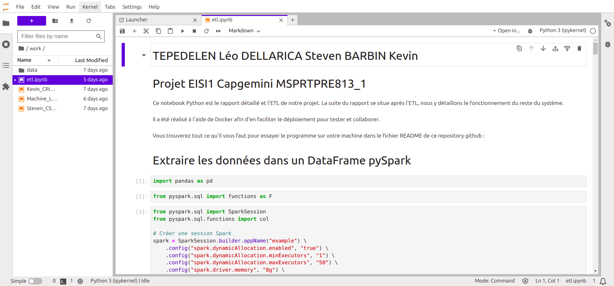

# MSPR TPRE813_1 EISI1 Capgemini

Résultat de la MSPR réalisé par DELLARICA Steven, TEPEDELEN Léo, BARBIN Kévin

## Consignes d'éxécutions
* Effectuer un gitclone `https://github.com/Lingatsu/MSPR_TPRE813_1.git`
* Se déplacer dans le répertoire `MSPR_TPRE813_1/`
* Effectuer un `docker-compose up` (ou `sudo docker compose up` sous linux) avec votre invite de commande
* Aller sur `http://localhost:8888/` et copier le token (que vous pourrez trouver dans les logs de votre invite de commande) puis le coller pour accéder à jupyter notebook ou cliquez sur le lien qui apparaît dans le terminal
* Aller dans le répertoire `work/` et double-cliquer sur etl.ipynb
* Lancer la totalité du notebook en cliquant sur les deux flèche en haut (fastforward) et, cliquer sur `restart` au pop-up et patienter 
(Si il y a un `*` à côté du bloc de code cela indique que l'étape est en cours. Si il y a un nombre, cela indique que l'étape a été réalisé.)
* Si vous souhaitez visualiser la base de donnée vous pouvez aller sur `http://localhost:8080/` pour accéder à phpmyadmin
* Vous devriez désormais voir plusieurs table à l'intérieur de la BDD `mspr1` si tout s'est déroulé avec succès

## Résultat Final

